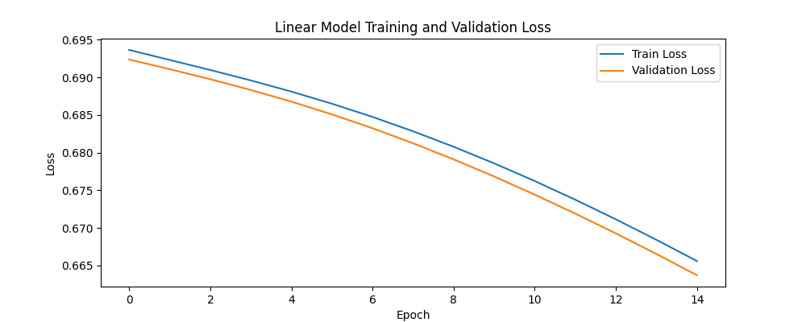
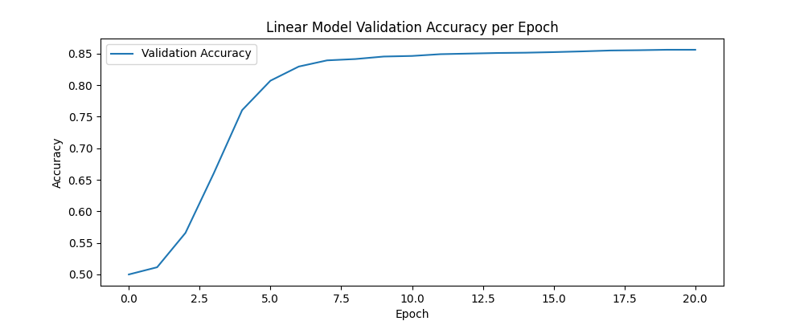
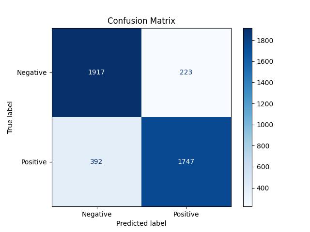

# steam-sentiment-analysis-tool

Sentiment analysis tool for Steam game reviews. Fetches real user reviews using the Steam API and generates an objective aggregate sentiment score for any game, providing buyers with a more transparent, data-driven view than store ratings.

---

# Main Linear Model

## Training Model

To run the main model

```
cd src/
python ./train_model.py <input_csv> -<flag>
```

Arguments

- <input_csv>: Path to the cleaned CSV file containing the reviews (e.g., ./data/cleaned_reviews.csv)
- <flag>: Choose a flag
  - `-t`: train the model from scratch.
  - `-l`: load the weights from training.

---

# Web App

## Features

- Preprocessing and TF-IDF vectorisation
- PyTorch linear classifier
- Web interface for querying any Steam game
- Backend FastAPI for predictions
- Visaulize model metrics and prediction summaries

## Installation

1. Clone the Repository

```
git clone https://github.com/krishsonvane14/steam-sentiment-analysis-tool.git
cd steam-sentiment-analysis-tool
```

2. Install Dependencies

```
pip install -r requirements.txt
```

## Running the Web App

```
cd src/app
python ./start.py
```

This script launches the FastAPI backend and opens the frontend interface in your defaul browser.
If it does not open, visit:

```
http://127.0.0.1:5500/index.html
```

- Troubleshooting:
  - The table contents may take a second to load
  - Refresh a few times to fix it

## Model Information

The saved model weights are located at:

```
/src/app/backend/linear_model.pth
/src/app/backend/logistical_model.pth
```

The saved vectorizers are located at:

```
/src/app/backend/linear_tfidf_vectorizer.pkl
/src/app/backend/logistic_tfidf_vectorizer.pkl
```

To retrain the models in the backend

```
cd src/app/backend
python ./linear_model.py <input.csv>
python ./logistic_model.py <input.csv>
```

## Example Outputs

<div align="center">







</div>
